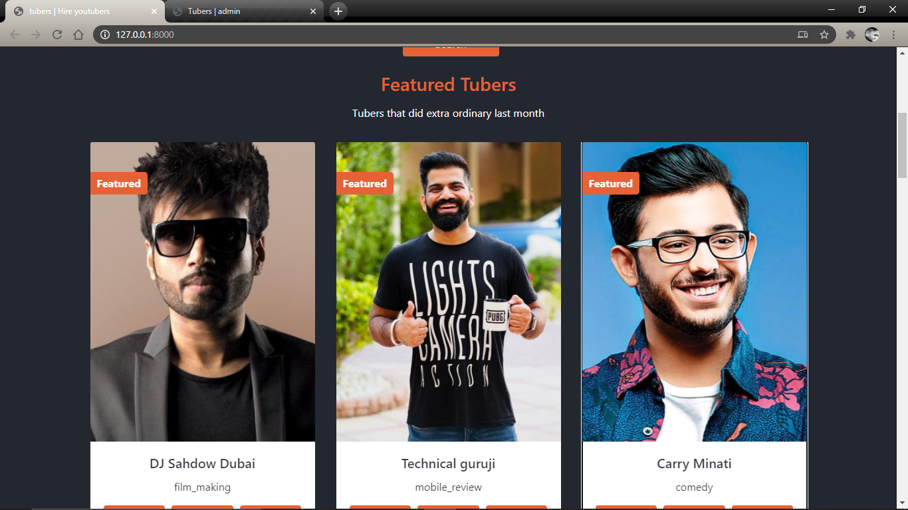
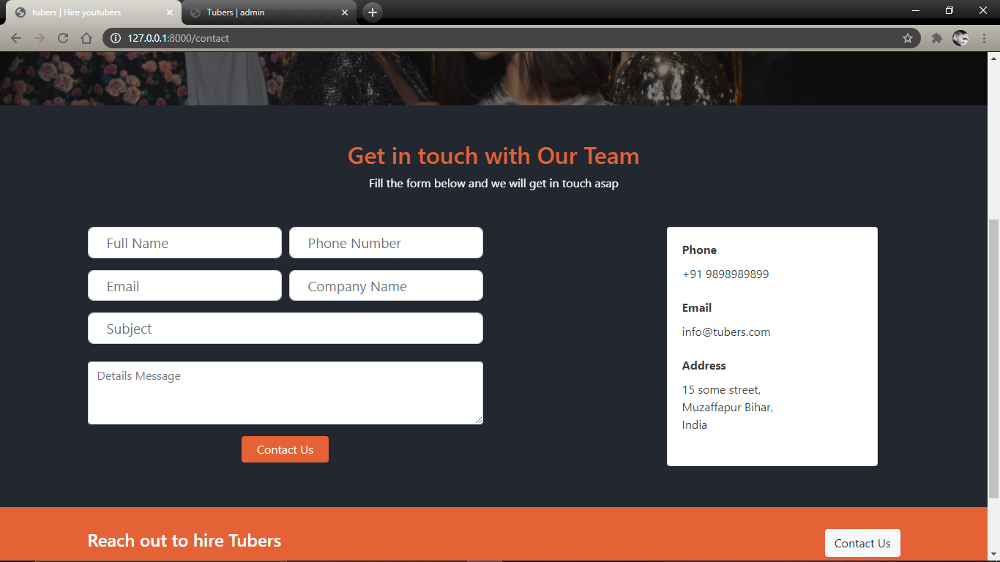
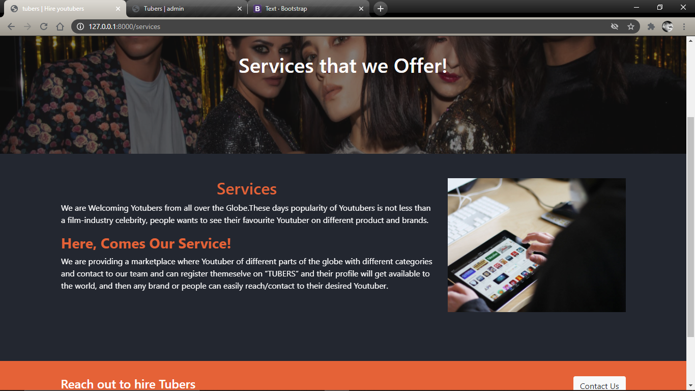

# Tubers
### A marketplace for Youtubers

## Getting Started

1. Prerequesite 
    * Python
    * HTML 
    * CSS

2. Additional Tools
    * VS Code
    * Pillow
    * ckEditor

3. Technologies
    * Python
    * Django
    * postgreSQL (Database)
    * Facebook Authentication
## What we are trying to solve
    These days popularity of Youtubers is not less than a bollywood celebrity. These days everyone  
    wants to see their favourite youtuber at differnet Concert, product promotion and events,but  
    sometimes it is hard for an authority to find their contact details and the only option is to  
    Email them but sometime it may happens that the youtuber didn't check their mail and don't  
    reply ,and sometimes, it is hard to get the email of youtuber. So here, we are trying to  
    solve this issue, We are creating an application where YOUTUBERS can register themselve and  
    anyone who wants business (promotion, event etc.) can contact them easily by filling the form.
    
## Some Snapshots

## Waiting for Collaborator...

